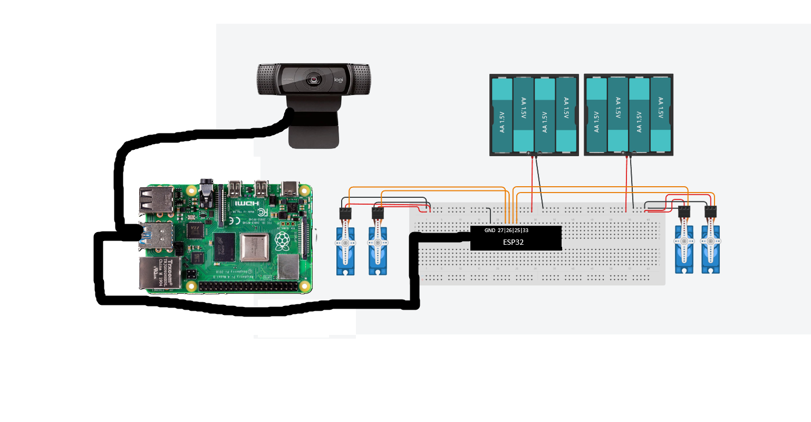

# Pose Estimation
With a Raspberry Pi and TensorFlow's PoseNet machine learning model, I changed this pose estimator from a purely coding project into a wooden box with two arms attached, which would mimic your arms.

| **Engineer** | **School** | **Area of Interest** | **Grade** |
|:--:|:--:|:--:|:--:|
| Devan G | Marin Academy | Electrical Engineering | Incoming Junior


  
# Final Milestone

<iframe width="560" height="315" src="https://www.youtube.com/embed/FYkCytQ0Mls" title="Milestone 3 - Devan" frameborder="0" allow="accelerometer; autoplay; clipboard-write; encrypted-media; gyroscope; picture-in-picture; web-share" referrerpolicy="strict-origin-when-cross-origin" allowfullscreen></iframe>

For my final milestone, I got two new robotic arms and stuck them onto a wooden box. It now mirrors both of my arms, tracking them and sending the angles to the ESP32, which has them write to the servos. Because these arms had the largest capacities for movement than my last arm, I had to create a mapping angle function which would turn the possible -180 to +180 degrees into 0-180, adjusting for the servo's  limited movement. I overcomplicated this mapping function a bit because, in the end, all I needed to do was just add 90* to the arm angle, and it would be adjusted. While installing all of the electronics inside the box, my Raspberry Pi got twisted up, and the Picam broke, meaning I had to make a last-minute adjustment to the code for it to work with a USB webcam. However, in the end, this ended up helping me as the USB webcam was way better at tracking my joints than the Picam and could provide a smoother, faster flask output.

# Second Milestone

<iframe width="560" height="315" src="https://www.youtube.com/embed/5flAucnnV8M" title="Devan G. Milestone 2" frameborder="0" allow="accelerometer; autoplay; clipboard-write; encrypted-media; gyroscope; picture-in-picture; web-share" referrerpolicy="strict-origin-when-cross-origin" allowfullscreen></iframe>

For my second milestone, I added a physical robotic arm from one of my past projects to mirror my left arm. First, I had to set up a math function which using code inspired by <a href="https://stackoverflow.com/questions/72601765/calculate-angle-between-two-coordinates-python"> this StackOverflow forum. </a> With these angles, I then send them over to an ESP32 from another one of my past projects, and the ESP32 controls the servos and has them mimic my arm. It is a bit delayed, but it still does a good job of copying my movements. Sometimes it struggles with tracking my wrist because of the lighting, so in the future, for my next milestone, I'll try to improve the live movement for both arms. I didn't have any major obstacles for this milestone; some little problems I had were errors with the virtual environment or powering issues, but those were solved by creating a new virtual environment and adding a battery pack, respectively.

# First Milestone

<iframe width="560" height="315" src="https://www.youtube.com/embed/0AwXptokzxw" title="Devan G. Milestone 1" frameborder="0" allow="accelerometer; autoplay; clipboard-write; encrypted-media; gyroscope; picture-in-picture; web-share" referrerpolicy="strict-origin-when-cross-origin" allowfullscreen></iframe>

For my first milestone, I set up pose estimation using this <a href="https://github.com/ecd1012/rpi_pose_estimation"> code from this Github. </a> The pose estimation uses the TensorFlow PoseNet model to place keypoints on the different joints it tracks, like elbows and knees, and then draws a line through them, giving you the full pose estimation. When implementing it, I  struggled with downloading OpenCV and other libraries, as they often wouldn't compile correctly or not even compile at all. In the end, however, like most things, I simply reflashed my Pi and started from a clean slate, where it immediately worked perfectly. It was quite frustrating to be on the same error for days only to realize after your latest debugging attempt that you downloaded the wrong installation of PiOS.


# Schematics 


# Code
Here is the code for the Raspberry Pi

<div style="max-height: 300px; overflow-y: auto;">
```python
import os
import argparse
import cv2
import numpy as np
import time
from threading import Thread
import importlib.util
from flask import Flask, Response, render_template_string
import serial
import math

ser = None
last_send_time = 0

def init_serial():
    global ser
    if ser is None:
        try:
            ser = serial.Serial('/dev/ttyUSB0', 115200, timeout=0.01)
            time.sleep(0.1)
        except:
            ser = None

class VideoStream:
    def __init__(self, src=0, resolution=(640, 480)):
        self.stream = cv2.VideoCapture(src)
        self.stream.set(cv2.CAP_PROP_FRAME_WIDTH, resolution[0])
        self.stream.set(cv2.CAP_PROP_FRAME_HEIGHT, resolution[1])

        ret, self.frame = self.stream.read()
        if not ret:
            raise ValueError("Unable to read from camera")
            
        self.stopped = False

    def start(self):
        Thread(target=self.update, args=(), daemon=True).start()
        return self

    def update(self):
        while not self.stopped:
            ret, frame = self.stream.read()
            if ret:
                self.frame = frame

    def read(self):
        return self.frame

    def stop(self):
        self.stopped = True
        self.stream.release()

def keypoint_angle(keypoint_positions):
    global ser, last_send_time

    current_time = time.time()
    if current_time - last_send_time < 0.1:
        return
    
    # Quick validation
    if len(keypoint_positions) < 11:
        return
    
    right_shoulder = keypoint_positions[5]
    right_elbow = keypoint_positions[7]
    right_wrist = keypoint_positions[9]
    left_shoulder = keypoint_positions[6]
    left_elbow = keypoint_positions[8]
    left_wrist = keypoint_positions[10]
    
    right_upper_dx = right_elbow[0] - right_shoulder[0]
    right_upper_dy = right_elbow[1] - right_shoulder[1]
    right_shoulder_angle = math.degrees(math.atan2(-right_upper_dy, right_upper_dx)) 
    
    left_upper_dx = left_elbow[0] - left_shoulder[0]
    left_upper_dy = left_elbow[1] - left_shoulder[1]
    left_shoulder_angle = math.degrees(math.atan2(-left_upper_dy, left_upper_dx))
 
    right_upper_vec = [right_upper_dx, right_upper_dy]
    left_upper_vec = [left_upper_dx, left_upper_dy]

    right_lower_dx = right_wrist[0] - right_elbow[0]
    right_lower_dy = right_wrist[1] - right_elbow[1]
    right_lower_vec = [right_lower_dx, right_lower_dy]
    
    left_lower_dx = left_wrist[0] - left_elbow[0]
    left_lower_dy = left_wrist[1] - left_elbow[1]
    left_lower_vec = [left_lower_dx, left_lower_dy]

    def vector_angle(v1, v2):
        dot_product = v1[0]*v2[0] + v1[1]*v2[1]
        mag1 = math.sqrt(v1[0]**2 + v1[1]**2)
        mag2 = math.sqrt(v2[0]**2 + v2[1]**2)
        if mag1 == 0 or mag2 == 0:
            return 0
        cos_angle = dot_product / (mag1 * mag2)
        cos_angle = max(-1, min(1, cos_angle))  
        return math.degrees(math.acos(cos_angle))
    
    right_elbow_angle = vector_angle(right_lower_vec, right_upper_vec)
    left_elbow_angle = vector_angle(left_lower_vec, left_upper_vec)

    right_shoulder_servo = max(0, min(180, right_shoulder_angle + 180))
    left_shoulder_servo = max(0, min(180, left_shoulder_angle))

    right_elbow_servo = max(0, min(180, 180 - right_elbow_angle))
    left_elbow_servo = max(0, min(180, 180 - left_elbow_angle - 90))

    if ser is None:
        init_serial()
    
    if ser:
        try:
            message = f"{int(right_shoulder_servo)},{int(right_elbow_servo)},{int(left_shoulder_servo)},{int(left_elbow_servo)}\n"
            ser.write(message.encode('utf-8'))
            last_send_time = current_time
            print(f"Sent: R_shoulder={right_shoulder_angle:.1f}°→{right_shoulder_servo}, R_elbow={right_elbow_angle:.1f}°→{right_elbow_servo}, L_shoulder={left_shoulder_angle:.1f}°→{left_shoulder_servo}, L_elbow={left_elbow_angle:.1f}°→{left_elbow_servo}")
        except:
            ser = None

app = Flask(__name__)

parser = argparse.ArgumentParser()
parser.add_argument('--modeldir', required=True)
parser.add_argument('--graph', default='detect.tflite')
parser.add_argument('--threshold', default=0.5)
args = parser.parse_args()

MODEL_NAME = args.modeldir
GRAPH_NAME = args.graph
min_conf_threshold = float(args.threshold)

pkg = importlib.util.find_spec('tensorflow')
if pkg is None:
    from tflite_runtime.interpreter import Interpreter
else:
    from tensorflow.lite.python.interpreter import Interpreter

interpreter = Interpreter(model_path=os.path.join(os.getcwd(), MODEL_NAME))
interpreter.allocate_tensors()
input_details = interpreter.get_input_details()
output_details = interpreter.get_output_details()
height = input_details[0]['shape'][1]
width = input_details[0]['shape'][2]
output_stride = 32
floating_model = (input_details[0]['dtype'] == np.float32)
input_mean = 127.5
input_std = 127.5

def mod(a, b):
    return np.subtract(a, np.multiply(np.floor_divide(a, b), b))

def sigmoid(x):
    return 1 / (1 + np.exp(-x))

def sigmoid_and_argmax2d(threshold):
    v1 = interpreter.get_tensor(output_details[0]['index'])[0]
    reshaped = np.reshape(v1, [-1, v1.shape[2]])
    reshaped = sigmoid(reshaped)
    reshaped = (reshaped > threshold) * reshaped
    coords = np.argmax(reshaped, axis=0)
    yCoords = np.round(np.expand_dims(np.divide(coords, v1.shape[1]), 1))
    xCoords = np.expand_dims(mod(coords, v1.shape[1]), 1)
    return np.concatenate([yCoords, xCoords], 1)

def get_offset_point(y, x, offsets, keypoint, num_key_points):
    return np.array([offsets[y, x, keypoint], offsets[y, x, keypoint + num_key_points]])

def get_offsets(coords, num_key_points=17):
    offsets = interpreter.get_tensor(output_details[1]['index'])[0]
    offset_vectors = np.array([]).reshape(-1, 2)
    for i, (y, x) in enumerate(coords):
        y = min(int(y), 8)
        x = min(int(x), 8)
        offset_vectors = np.vstack((offset_vectors, get_offset_point(y, x, offsets, i, num_key_points)))
    return offset_vectors

def draw_lines(keypoints, image, bad_pts):
    color = (0, 255, 0)
    thickness = 2
    arm_map = [[5,7], [7,9], [6,8], [8,10]]
    body_map = [[5,6], [5,11], [6,12], [11,12], [11,13], [13,15], [12,14], [14,16]]
    
    for map_pair in arm_map:
        if map_pair[0] in bad_pts or map_pair[1] in bad_pts:
            continue
        start = (int(keypoints[map_pair[0]][1]), int(keypoints[map_pair[0]][0]))
        end = (int(keypoints[map_pair[1]][1]), int(keypoints[map_pair[1]][0]))
        image = cv2.line(image, start, end, (0, 255, 255), thickness + 1)
    
    for map_pair in body_map:
        if map_pair[0] in bad_pts or map_pair[1] in bad_pts:
            continue
        start = (int(keypoints[map_pair[0]][1]), int(keypoints[map_pair[0]][0]))
        end = (int(keypoints[map_pair[1]][1]), int(keypoints[map_pair[1]][0]))
        image = cv2.line(image, start, end, color, thickness)
    
    return image

def draw_keypoints_on_frame(frame, keypoints, drop_pts, scale_x, scale_y):
    """Draw keypoints on the original frame with proper scaling"""
    keypoint_names = [
        "nose", "left_eye", "right_eye", "left_ear", "right_ear",
        "left_shoulder", "right_shoulder", "left_elbow", "right_elbow", 
        "left_wrist", "right_wrist", "left_hip", "right_hip",
        "left_knee", "right_knee", "left_ankle", "right_ankle"
    ]
    
    for i in range(len(keypoints)):
        if i in drop_pts:
            continue
            
        x = int(keypoints[i][1] * scale_x)
        y = int(keypoints[i][0] * scale_y)
        
        if i in [5, 6, 7, 8, 9, 10]:  
            cv2.circle(frame, (x, y), 8, (0, 255, 255), -1)
            cv2.circle(frame, (x, y), 10, (0, 0, 255), 2)  
        elif i in [0]:  
            cv2.circle(frame, (x, y), 6, (0, 0, 255), -1)
        elif i in [1, 2, 3, 4]:  
            cv2.circle(frame, (x, y), 4, (255, 0, 0), -1)
        else:  
            cv2.circle(frame, (x, y), 6, (0, 255, 0), -1)

        if i < len(keypoint_names):
            cv2.putText(frame, f"{i}", 
                       (x + 12, y - 5), cv2.FONT_HERSHEY_SIMPLEX, 
                       0.4, (255, 255, 255), 1)
    
    return frame

def draw_skeleton_on_frame(frame, keypoints, drop_pts, scale_x, scale_y):
    arm_connections = [[5,7], [7,9], [6,8], [8,10]]
    body_connections = [[5,6], [5,11], [6,12], [11,12], [11,13], [13,15], [12,14], [14,16]]
    
    for connection in arm_connections:
        if connection[0] in drop_pts or connection[1] in drop_pts:
            continue
        start_x = int(keypoints[connection[0]][1] * scale_x)
        start_y = int(keypoints[connection[0]][0] * scale_y)
        end_x = int(keypoints[connection[1]][1] * scale_x)
        end_y = int(keypoints[connection[1]][0] * scale_y)
        cv2.line(frame, (start_x, start_y), (end_x, end_y), (0, 255, 255), 4)
    

    for connection in body_connections:
        if connection[0] in drop_pts or connection[1] in drop_pts:
            continue
        start_x = int(keypoints[connection[0]][1] * scale_x)
        start_y = int(keypoints[connection[0]][0] * scale_y)
        end_x = int(keypoints[connection[1]][1] * scale_x)
        end_y = int(keypoints[connection[1]][0] * scale_y)
        cv2.line(frame, (start_x, start_y), (end_x, end_y), (0, 255, 0), 2)
    
    return frame

def generate_frames():
    videostream = VideoStream(src=0, resolution=(640, 480)).start()
    time.sleep(1)

    try:
        while True:
            frame1 = videostream.read()
            frame1 = cv2.flip(frame1, 1)
            original_height, original_width = frame1.shape[:2]
            
            frame1_rgb = cv2.cvtColor(frame1, cv2.COLOR_BGR2RGB)
            
            frame_resized = cv2.resize(frame1_rgb, (width, height))
            input_data = np.expand_dims(frame_resized, axis=0)
            
            if floating_model:
                input_data = (np.float32(input_data) - input_mean) / input_std

            interpreter.set_tensor(input_details[0]['index'], input_data)
            interpreter.invoke()

            coords = sigmoid_and_argmax2d(min_conf_threshold)
            drop_pts = list(np.unique(np.where(coords == 0)[0]))
            offset_vectors = get_offsets(coords)
            keypoint_positions = coords * output_stride + offset_vectors
            
            keypoint_angle(keypoint_positions)

            scale_x = original_width / width
            scale_y = original_height / height

            frame1_rgb = draw_skeleton_on_frame(frame1_rgb, keypoint_positions, drop_pts, scale_x, scale_y)
  
            frame1_rgb = draw_keypoints_on_frame(frame1_rgb, keypoint_positions, drop_pts, scale_x, scale_y)

            frame_bgr = cv2.cvtColor(frame1_rgb, cv2.COLOR_RGB2BGR)
            
            success, buffer = cv2.imencode('.jpg', frame_bgr)
            if not success:
                continue
            frame = buffer.tobytes()
            yield (b'--frame\r\n'
                   b'Content-Type: image/jpeg\r\n\r\n' + frame + b'\r\n')
    finally:
        videostream.stop()

@app.route('/')
def index():
    return render_template_string('''
        <html><body>
        <h1>USB Camera Robotic Arm Control</h1>
        
        </body></html>''')

@app.route('/video_feed')
def video_feed():
    return Response(generate_frames(), mimetype='multipart/x-mixed-replace; boundary=frame')

if __name__ == '__main__':
    init_serial()
    app.run(host='0.0.0.0', port=5000, debug=False)
```
</div>
Here is the code for the ESP32

```c++
#include <ESP32Servo.h>

char incomingData[50]; 
float angle1, angle2, angle3, angle4;

Servo servo1;  // Robot Left Shoulder (mirrors my right)
Servo servo2;  // Robot Left Elbow (mirrors my right)
Servo servo3;  // Robot Right Shoulder (mirrors my left)
Servo servo4;  // Robot Right Elbow (mirrors my left)

void setup() {
  Serial.begin(115200); 
  
  servo1.attach(26);  // Robot Left shoulder
  servo2.attach(27);  // Robot Left elbow  
  servo3.attach(33);  // Robot Right shoulder
  servo4.attach(25);  // Robot Right elbow
  
  // Center position at startup
  servo1.write(90);
  servo2.write(90);
  servo3.write(90);
  servo4.write(90);
  
  delay(1000);
}

void loop() {
  if (Serial.available() > 0) {
    int bytesRead = Serial.readBytesUntil('\n', incomingData, sizeof(incomingData) - 1); 
    incomingData[bytesRead] = '\0'; 
    
    // Parse input: left_shoulder, left_elbow, right_shoulder, right_elbow
    char *token;
    token = strtok(incomingData, ","); 
    if (token != NULL) angle1 = atof(token);  // Your right shoulder → Robot left
    
    token = strtok(NULL, ","); 
    if (token != NULL) angle2 = atof(token);  // Your right elbow → Robot left
    
    token = strtok(NULL, ","); 
    if (token != NULL) angle3 = atof(token);  // Your left shoulder → Robot right
    
    token = strtok(NULL, ","); 
    if (token != NULL) angle4 = atof(token);  // Your left elbow → Robot right
    
    // Constrain values to servo range (just in case)
    angle1 = constrain(angle1, 0, 180);
    angle2 = constrain(angle2, 0, 180);
    angle3 = constrain(angle3, 0, 180);
    angle4 = constrain(angle4, 0, 180);
    
    // Optional: Add smoothing or mirroring adjustments here if needed
    // For example, if you want the robot to mirror exactly:
    // angle3 = 180 - angle3;  // Mirror right shoulder
    // angle1 = 180 - angle1;  // Mirror left shoulder
    
    // Debug output
    Serial.println("=== SERVO COMMANDS ===");
    Serial.print("Robot L.Shoulder: "); Serial.println(angle1);
    Serial.print("Robot L.Elbow: "); Serial.println(angle2);
    Serial.print("Robot R.Shoulder: "); Serial.println(angle3);
    Serial.print("Robot R.Elbow: "); Serial.println(angle4);
    Serial.println();
    
    // Move servos directly (no complex mapping needed)
    servo1.write(angle1);
    servo2.write(angle2);
    servo3.write(angle3);
    servo4.write(angle4);
    
    delay(50);
  }
}
```

# Bill of Materials

| **Part** | **Note** | **Price** | **Link** |
|:--:|:--:|:--:|:--:|
| Raspberry Pi | Running the Pose Estimation and sending data to the ESP32 | $65.79 | <a href="https://www.amazon.com/Raspberry-Pi-RPI4-MODBP-4GB-Model-4GB/dp/B09TTNF8BT/ref=sr_1_5?crid=2PFRVYFGBFU6C&dib=eyJ2IjoiMSJ9.4wZGiZcG7IfVeIs8ylcbrzsNv6dicwLzRFdua87NS7KterViSIylhvpNrT0tJWntPeTQ0HrgdGEXcuu8FXb0FD2ymHB1wOROyRlxmTz2iCmo51HPUEuTUaHTlglcURSAp32HKlF_d6ioaeKGY3JlrS2lsLIpFdsavQi3iIYeylgw8LWZ7vui4Z7cxprbqbfvYvCe7BELN2fcPanVJbIH7KOjK7zTE7hjNz24YG9xkhw._FVVYrj3PGa0XylewwvYFnARQmgirEqjextRRr8q4YI&dib_tag=se&keywords=raspberry+pi+4&qid=1753454567&sprefix=raspberry+pi+%2Caps%2C187&sr=8-5"> Link </a> |
| ESP32 | Recieving Signals from the Pi and sending them to the motors | $5.33 | <a href="https://www.amazon.com/ESP-WROOM-32-Development-Microcontroller-Integrated-Compatible/dp/B08D5ZD528/ref=sr_1_1_sspa?dib=eyJ2IjoiMSJ9.qMJJKscaTbDZH8KOrPXaSvvBOSev_9dSPToXjxjL2hu9zL45w0lOVcpG7nBfByg6UuLRb_xuM30wtiAZwH85rvaF-StxrW9crerN0IimoqGyfZTDrmcBBe8_7mIwzHjka0OQE5PYYVeJjtDZsuFwHpBuEfkR7l4Yv2ObZcRNFn9kbc0dsMF-rQ5Csw9lF_iUk3-bkgbA271VDwhROMTFhLvg5-Qz50GK-n3E9g2tduU.M63A4dUb24JJnhw5qQ-BVFb1K9gBOhHLl7rOVWV4AfE&dib_tag=se&keywords=esp32%2Bwroom&qid=1753454035&sr=8-1-spons&sp_csd=d2lkZ2V0TmFtZT1zcF9hdGY&th=1"> Link </a> |
| Robotic Arm Kit x 2| Physical Robotic Arm which moves with your arm | $59.49 | <a href="https://www.amazon.com/Adeept-Robotic-Compatible-Programmable-Processing/dp/B087R8DLG6?source=ps-sl-shoppingads-lpcontext&ref_=fplfs&smid=A38P1L5SR7BRGU&utm_source=chatgpt.com&th=1"> Link </a> |
| USB Webcam | Capture live video | $18.97 | <a href="https://www.amazon.com/TRAUSI-Microphone-Cancellation-Wide-Angle-Correction/dp/B0F1G3RZF9/ref=sr_1_6?crid=HLPQ0RUNCFDG&dib=eyJ2IjoiMSJ9.xVtRFzFOfA678C9UfJ2P5Ky2YrVW8p31gSgwIsr659A_l832qmpueWeiJ3bfMN63BX4H8LsS-wBf-sSPRPr3D29EtmMOZGarWbYLt1puZJEZJ3Xa-2xNHLBFcud9LJqy2iYX5iXMnoX1ZciVWr-36zLK8axz2B54Ou7XdxxAAsHzc5-oRn9kbgQRR-_2zLe2Jc6r4QfCXxewpHoRxy31Lu5lCYiwY0d_l42Cru5Q-8GfeqZSEps3BT-qObt6w_l4Bod9S4S-EEuLhZD7BPzxnEypb8XDcenBUAu808zIKQ0.wsDcIMJMmRLnslnNE9wlBeGZ-Hfl0XgsVRjyQuRRb8c&dib_tag=se&keywords=usb%2Bwebcam&qid=1753453810&s=electronics&sprefix=usb%2Bwebcam%2Celectronics%2C201&sr=1-6&th=1"> Link </a> |
