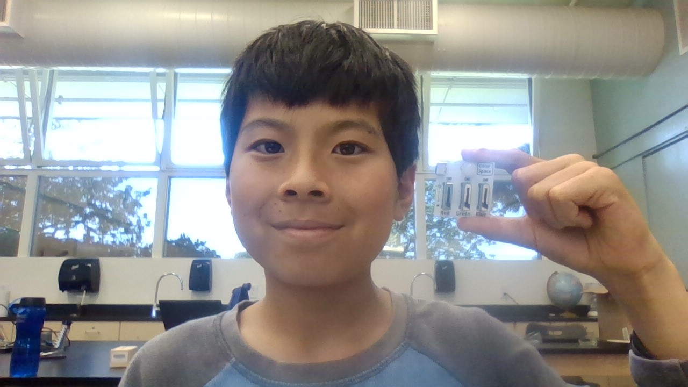
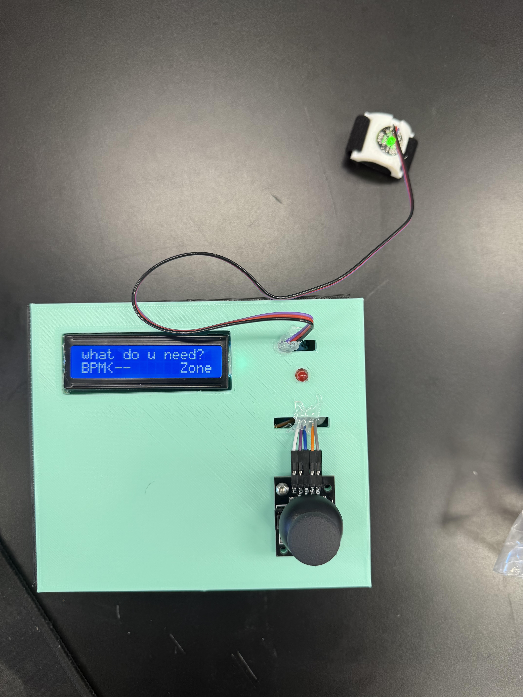
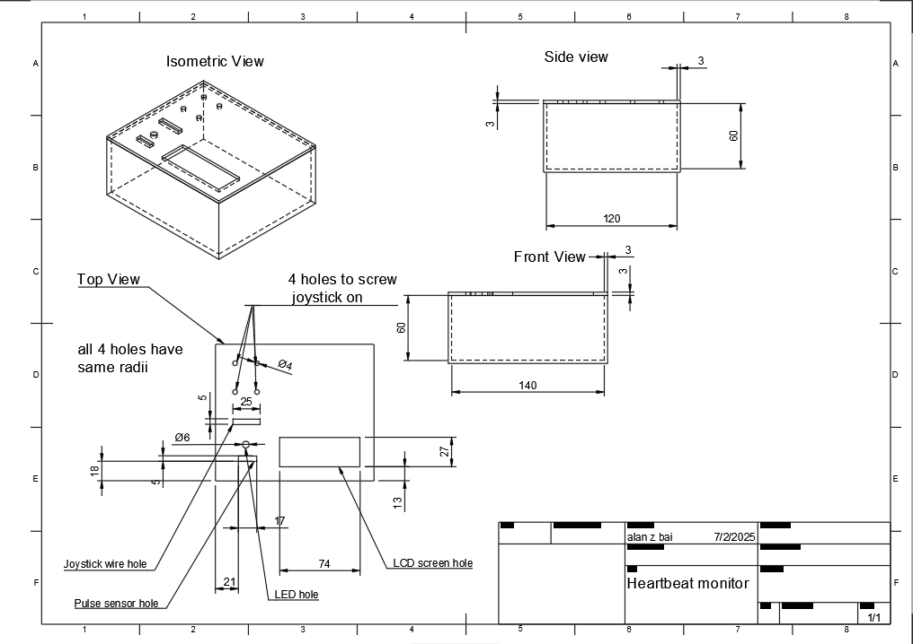
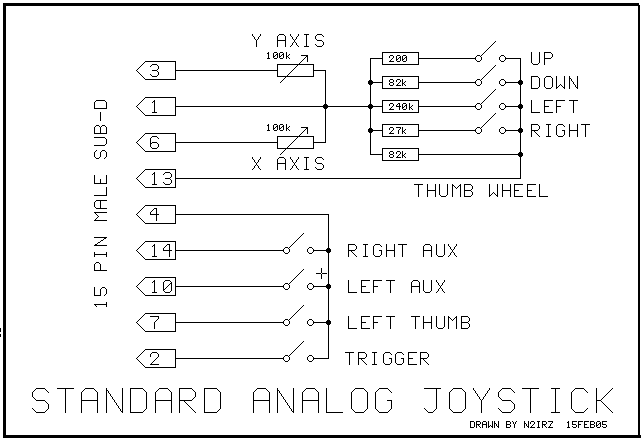
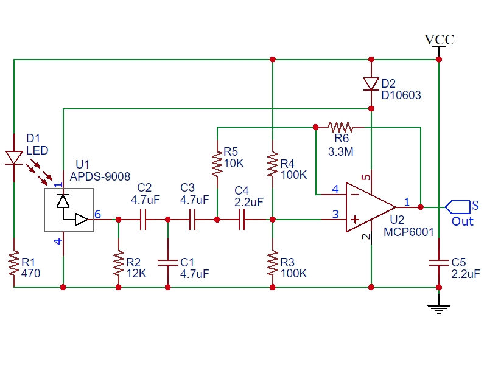
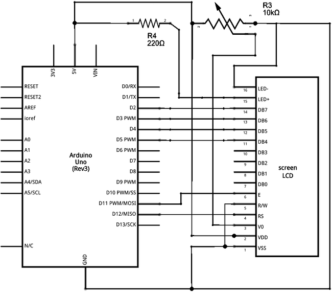
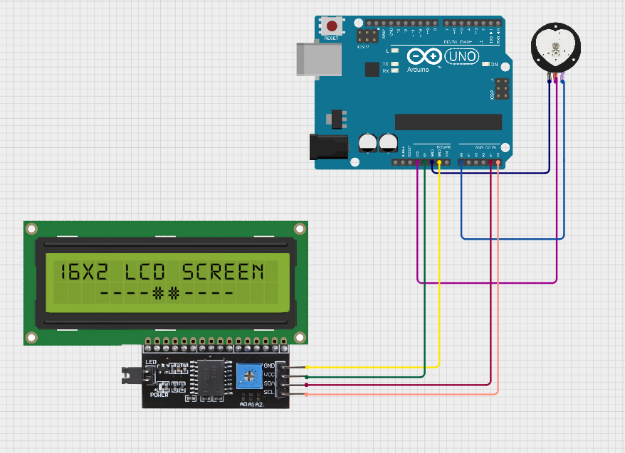

# BlueStamp Biometric Health Monitor
The biometric health monitor is able to check a person's heartbeat at any time as well as tracking the percentage of time in each cardio zone. It uses an LCD screen that displays information, a pulse sensor to detect the pulse, and a joystick similar to a controller to change the screen that the LCD is on.

| **Engineer** | **School** | **Area of Interest** | **Grade** |
|:--:|:--:|:--:|:--:|
| Alan B | Crocker Middle School | Electrical Engineering | Incoming 8th Grader |



# Challenges and Lessons Learned

I experienced many challenges while building my project. From coding to CAD, they were all an essential part of the process. For example, I had no experience coding and had to learn all the functions. I also needed to learn analog and digital pins on the arduino board for my project. In fact, everything taught at Bluestamp was new to me. CAD was also hard. Kevin had to teach me how tools like offset and extrude work. I also had to make a CAD drawing which is similar to a blueprint so anyone can recreate what I made. I also learned soldering for the first time and was able to "glue" two pieces of wire together using metal from soldering. My biggest challenge would probably be debugging though. It is easy to just write some code, but it is really hard to find out why it does not work. For example, I spent oer a day wondering why the code was not doing what it was supposed to when it turns out some brackets and other small stuff were messing it up. However, from these experiences, I learned some lessons. I learned how it is important to be persistent and never give up. I also learned that it is okay to ask for help when needed. Overall, Bluestamp was a great experience that not only taught skills, but also lessons.

# Modifications


Figure 1 - Completed project

I made several modifications and learned many things from it. I added exercise zones. Exercise zones are a way to tell how hard you are working in an exercise. Zone 1 is 0-50% of your maximum heartrate, zone 2 is 50-60% of your maximum heartrate and so on. For this, I used an array that saves the amount of time in each zone. An array is a list with elements that you can change. By changing the elements, you are able to read them later on which is basically how you can display data. However, I had two different screens, the BPM and the exercise zones. So, I used a joystick that can control what screen you are on. Then, I added the first screen to be a choice screen where you can choose between each option. To do this, I added a variable solely used to check what screen the user is on and what to display. From this experience, I learned a lot of coding. However, the code did not work. So, I spent over a day on debugging everything. Debugging is necessary to coding as there are many small mistakes that can be made. The debugging take a long time since there are many places that can have mistakes. For example, I spent over a day just to find out that one of my lines of code was 3 line lower then it should have been. I also spent over an hour realizing that my prackets were paired wrong and excluded code. This experience taught me persitence and to look thouroughly. Next, I designed a box for my arduino and parts. I made a CAD box that could fit my arduino and parts. However, this was a challenge since I had no prevoius experience. Luckily, my instructor taught me how to use autodesk. I learned how to use the tools like extrude and offset. This taught me how to work under pressure.

# Final Milestone

<iframe width="1521" height="561" src="https://www.youtube.com/embed/-IHDq-rNkMA?list=PLe-u_DjFx7eui8dmPGji-0-slT8KydYv_" title="Alan B. Modification" frameborder="0" allow="accelerometer; autoplay; clipboard-write; encrypted-media; gyroscope; picture-in-picture; web-share" referrerpolicy="strict-origin-when-cross-origin" allowfullscreen></iframe>

# Description
Since the previous milestone, I added a box and soldered everything together. To make the box, you have to use CAD and design a box. To actually design the box, you have to measure each piece with a caliper. After that, you can make a sketch so then you can build the base and walls. However, you need to then use the extrude tool to make it in the third dimension. Then, you have to add an offset which accounts for extra room so everything can fit. Once, you build the box succesfully, you start the printing process. However, you also have to make a drawing of what you built. A drawing is similar to a blueprint so anyone who looks at it can recreate it. You have to dimension it so the people looking at it are able to tell what values are on each part. Now that the box is printed, you are able to bring it anywhere without worrying about it falling apart. The soldering was done by heating up an easily meltable metal and heating it up then cooling it so it glues two pieces together. 

# Challenges

This milestone had a lot of challenges. For example, I had no experience in 3D printing. I also had trouble soldering everything together. I had no idea how design a box in autodesk fusion. Luckily, my instructor Kevin Yuan helped me design the box. However, it still took quite a while since I had no idea what each tool was used for and how to use them. We were able to 3D print the box on time albeit on the last day. However, I also had to do a CAD drawing which is similar to a blueprint. Using the CAD drawing (refer to figure 2) anyone is able to reproduce the same thing. For soldering, even though there was a fan that filtered almost all of the toxic fumes, I was still kind of scared that I would suddenly develop a lung disease. That and the fact that I was nervous made soldering everything a challenge.



Figure 2 - Pulse sensor monitor box drawing

# Next steps

Although I finished my project. If I had more time I would add screws to everything so the box can be safely screwed together. It would also allow you to shake the box a little without hearing everything fall apart. I would also add more screens like something to detect high heartbeat jumps or something similar.

# Second Milestone

<iframe width="914" height="514" src="https://www.youtube.com/embed/J7XCA21g0Ys?list=PLe-u_DjFx7eui8dmPGji-0-slT8KydYv_" title="Alan B. Milestone 2" frameborder="0" allow="accelerometer; autoplay; clipboard-write; encrypted-media; gyroscope; picture-in-picture; web-share" referrerpolicy="strict-origin-when-cross-origin" allowfullscreen></iframe>

# Description

After finishing my beats per minute, I immedietly started working on modifications. I first made it so it starts you off in a screen where you can choose within two options. However, I did not know how to choose between each option. I eventually decided on using a joystick (refer to figure 3) so you can move between options and press the button to confirm. The joystick has 5 wires, one of them is for ground, another is for the power and the other three track whats it's doing. For example, one wire tracks the x position(left and right) and another is responsible for the y position(up and down). This works because there is a potentiometer (refer to figure 4) that changes the current based off of where the joystick is facing. This is then interpreted to see where the joystick is. However, to change the amount of current it needs a potentiometer which works by using a wiper on a resistor track and moves the wiper depending on how much resistance is needed. For the button, when it is pressed, it completes an electrical circuit which tells the arduino whether or not it is pressed. I made another modification so that it makes the led light up if your heartbeat is over a certain level. I also added workout zones. There are 5 zones, 0-50% of your maximum heartrate, 50-60% and so on. Then, if you press the button again, it ends your exercise and shows you the percentage that you were in each zone. Once you are done, you can press the button again to restart it incase you want to use a different function like the BPM measurer. Now, the circuit is made up of an arduino, breadboard, pulse sensor, LCD, and joystick (refer to figure 5).



Figure 3 - Joystick schematic


Figure 4 - Potentiometer schematic


  
Figure 5 - Circuit diagram of joystick, LCD, and pulse sensor connected to the arduino
  


# Challenges

However, this milestone was the hardest one of them all. This was mainly because of the amount of coding that it required. For example, I spent an entire day of debugging trying to figure out why my code jsut skipped a screen. Then, I realized that one line of code should be placed 3 lines earlier than it was. Another time, I was wondering why half my code did not work when I found out that a bracket was paired wrong and it excluded the code. I also did not know too much code especially with arrays. Arrays are a list that can store data as elements which can be changed or read to see the value. I needed the array to store the amount of time in each zones. For example, if someone spent 3 second in zone 1, 5 seconds in zone 2, 3 seconds in zone 3, and 0 seconds in the other two zones, it would look like z[] = {3,5,3,0,0}. However, to change screens, I also had to use a variable that took a long time to debug since all the information of each screen corresponds to the value of the integer.

# Next Steps

Now that I am done with my coding, I am going to make a case so that it is portable and you can exercise with it. This will be done with a 3D printer. I will also need to first plan it on CAD before printing it.

# First Milestone

<iframe width="914" height="514" src="https://www.youtube.com/embed/a8BoErUSUk4?list=PLe-u_DjFx7eui8dmPGji-0-slT8KydYv_" title="Alan B. Milestone 1" frameborder="0" allow="accelerometer; autoplay; clipboard-write; encrypted-media; gyroscope; picture-in-picture; web-share" referrerpolicy="strict-origin-when-cross-origin" allowfullscreen></iframe>

# Description

The first thing that I did was learn how to code for the arduino. I started off by making a simple blinking light using a LED circuit (refer to figure 6). Then, I learned how to code for the arduino. After, I believed I had enough knowledge to start building and coding the biometric health monitor. For the biometric health monitor, I used a pulse sensor (refer to figure 7), arduino uno, and a 16x2 LCD display monitor (refer to figure 8). The LCD works by having crystals between two polarized layers. When the crystals are twisted, no light can pass through making part of the screen look dark. When the crystal is untwisted, the light can pass illuminating the pixel of the screen. By using these crystals in unision, the LCD can display characters by light and dark pixels. The pulse sensor detects when a heartbeat happens by tracing the amount of light that it produces and the amount of light absorbed. When, a heartbeat happens, blood flows and therefore less light ight is reflected. The pulse sensor detects that and counts it as a heartbeat and then counts the amount of heartbeats. It then sends a signal to the arduino which takes the average amount of heartbeats and converts it into the amount of heartbeats per minute. The display monitor then displays it so the user can read their heart rate. I was successful in coding and wiring the project to work (refer to figure 9). 


  
Figure 6 - Circuit diagram of LED circuit



Figure 7 - Pulse sensor schematic

 

Figure 8 - LCD display schematic


  
Figure 9 - Circuit diagram of pulse sensor and display monitor connected

# Challenges

However, I faced many challenges. For example, I as a beginner in arduino coding and had no idea how analog pins work. I learned that digital pins only know 1 or 0 AKA yes or no. Analog pins on the other hand use a wide range of values. For example, a button would connect to a digital pin since it has two states, pressed and unpressed. A joystick on the other hand, would use analog pins to see how much it is moved. I also had some trouble with the wiring. This is because it was hard for me in the beginning to read where each wire goes and what they even mean. For example, I had no idea what "ground" was and why is was so important. I also realized that each pin in the arduino needs to be specifically named in the code. I also learned that each row in the breadboard is connected and you can share voltage in between them.

# Next Steps

Moving on, I will need to code more to detect high heartbeats, a buzzer to alert you about any problems with your heartbeat, and classify cardio zones. I plan to code the rest of the project in the next milestone and then put it together later to make it portable.


# Starter Milestone

<iframe width="1521" height="561" src="https://www.youtube.com/embed/PsNnBoVI7NY" title="Alan B. Starter Project" frameborder="0" allow="accelerometer; autoplay; clipboard-write; encrypted-media; gyroscope; picture-in-picture; web-share" referrerpolicy="strict-origin-when-cross-origin" allowfullscreen></iframe>

# Description

The RGB light is able to change into any color by changing the amount of red, green, and blue light outputted. I had no previous experience of soldering. However, this allowed me to learn more and gain experience on soldering through this project. There are three sliders that change the amount of red, green, and blue light is being emitted. There is also a LED with 4 prongs, one for ground, and 3 more for each color. There is also a port that allows you to connect it with a computer to provide battery.

# Challenges

For me, it was challenging in multiple ways. For example, I thought the longest wire was the positive side which although was true for most LED's, was not the case for the multi color one. Thus, I accidentally placed it the wrong way and fixed it later. I also never soldered before so I was kind of scared of having a 400 degrees celsius rod in my hands. However, I was able to finish the project successfuly.

# Next Steps

Now that I am done with my starter project, I will use the knowledge of circuits and soldering to make my intensive project. My intensive project is the biometric health monitor.

# Bill of Materials

| **Part** | **Note** | **Price** | **Link** |
|:--:|:--:|:--:|:--:|
| Analog Joystick | Used to change screens | $4 | <a href="https://makersportal.com/shop/analog-joystick-arduinoraspberry-pi-compatible?"> Link </a> |
| LCD 16x2 with I2C | Used to display the screen | $7 | <a href="https://store-usa.arduino.cc/products/16x2-lcd-display-with-i-c-interface?"> Link </a> |
| Pulse Sensor | Used to measure each heartbeat | $1.66 | <a href="https://www.ebay.com/itm/221892151873"> Link </a> |
| Arduino uno R3 | Microcontroller | $27.60 | <a href="https://store-usa.arduino.cc/products/arduino-uno-rev3?"> Link </a> |
| 2x4 Metal Breadboard | Holds all wires | $5.99 | <a href="https://www.schmalztech.com/products/2-x-4-protoboard?"> Link </a> |
| LED | Light that turns on when high heartbeat | $5.99 | <a href="https://shop.barnabasrobotics.com/products/3v-leds-for-arduino-and-raspberry-pi-projects?"> Link </a> |

# Appendix

# Milestone 1 Code

Testing code to begin understanding c++
```cpp
void setup() {
  // initialize digital pin LED_12 as an output.
    pinMode(LED_12, OUTPUT);
  }

void loop() {
  digitalWrite(LED_12, HIGH);  // turn the LED on (HIGH is the voltage level)
  delay(1000);                      // wait for a second
  digitalWrite(LED_12, LOW);   // turn the LED off by making the voltage LOW
  delay(1000);                      
  }

```
Pulse sensor BPM code
```cpp

#define USE_ARDUINO_INTERRUPTS true
#include <PulseSensorPlayground.h>
#include <LiquidCrystal_I2C.h>
LiquidCrystal_I2C lcd(0x27, 16, 2); // set the LCD address to 0x27 for a 16 chars and 2 line display

 
// Constants

const int PULSE_SENSOR_PIN = 0;  // Analog PIN where the PulseSensor is connected
const int LED_PIN = 13;          // On-board LED PIN
const int THRESHOLD = 550;       // Threshold for detecting a heartbeat


// Create PulseSensorPlayground object
PulseSensorPlayground pulseSensor;
void setup()
{
  // Initialize Serial Monitor
  Serial.begin(9600);
  lcd.init();
  lcd.backlight();
  
  pinMode(8, OUTPUT);
  // Configure PulseSensor
  pulseSensor.analogInput(PULSE_SENSOR_PIN);
  pulseSensor.blinkOnPulse(LED_PIN);
  pulseSensor.setThreshold(THRESHOLD);
  delay(5000);
  // Check if PulseSensor is initialized
  if (pulseSensor.begin())
  {
    Serial.println("PulseSensor object created successfully!");

    
  }
}

void loop()
{
  // Get the current Beats Per Minute (BPM)
  int currentBPM = pulseSensor.getBeatsPerMinute();
  // Check if a heartbeat is detected
  if (pulseSensor.sawStartOfBeat())
  {
    if (currentBPM>100){
      Serial.println("ur cooked");
      lcd.clear();
      lcd.setCursor(0,0);
      lcd.print("ur cooked");
      digitalWrite(8, HIGH);  // turn the LED on (HIGH is the voltage level)
      delay(100);                      // wait for a second
      digitalWrite(8, LOW);
      delay(100);
    }
      else {
        lcd.clear();
        lcd.setCursor(0, 0);
        lcd.print("Heart Rate");
        lcd.setCursor(0, 1);
        lcd.print("BPM: ");
        lcd.print(currentBPM);
        delay(100);
    }
  }
 
  // Add a small delay to reduce CPU usage
}
```

# Milestone 2 Code
Pulse Monitor with BPM and Exercise Zones
```cpp
#define VRX_PIN  A2 // Arduino pin connected to VRX pin
#define VRY_PIN  A1 // Arduino pin connected to VRY pin
#include <PulseSensorPlayground.h> //library pulse sensor
#include <LiquidCrystal_I2C.h>     ///library LCD
#include <ezButton.h>              ///library joystick
int age = 0; // age variable

const int PULSE_SENSOR_PIN = 0;  // Analog PIN where the PulseSensor is connected
const int LED_PIN = 13;          // On-board LED PIN
const int THRESHOLD = 600;       // Threshold for detecting a heartbeat
#define SW_PIN   2                // Arduino pin connected to SW  pin
int yValue = 0; // To store value of the X axis
ezButton button(SW_PIN);LiquidCrystal_I2C lcd(0x27, 16, 2);
int x=yValue;int MAX;int z[] = { 0, 0, 0, 0, 0, 0 };
bool ZONE_UPDATES= false;int bValue = 0; 
int screen = 0;int previousBPM;bool screenupdated = true;
bool stop = true;
PulseSensorPlayground pulseSensor;
void setup() {
  Serial.begin(9600) ;
  lcd.init();
lcd.backlight();
lcd.clear();
lcd.setCursor(0,0);
lcd.print("what do u need?");
lcd.setCursor(0,1);
lcd.print("BPM         Zones");
button.setDebounceTime(50);
pinMode(8, OUTPUT);
pulseSensor.analogInput(PULSE_SENSOR_PIN);
pulseSensor.blinkOnPulse(LED_PIN);
pulseSensor.setThreshold(THRESHOLD);
  if (pulseSensor.begin())
  {
  Serial.println("PulseSensor object created successfully!");
  }
}

void loop() {
  
  yValue = analogRead(VRY_PIN);
  Serial.print("x = ");
  Serial.print(yValue);
  x=yValue;
  bValue = button.getState();
  Serial.println(screen);
  button.loop();
  if (screen == 5){
      

   x=yValue;
  
    if (x>900){

      lcd.clear();
      lcd.print("z1:");
      lcd.print(100*z[0]/(z[0]+z[1]+z[2]+z[3]+z[4]+z[5]));
      lcd.print("%  z2:");
      lcd.print(100*z[1]/(z[0]+z[1]+z[2]+z[3]+z[4]+z[5]));
      lcd.print("%");
      lcd.setCursor(0,1);
      lcd.print("z3:");
      lcd.print(100*z[2]/(z[0]+z[1]+z[2]+z[3]+z[4]+z[5]));
      lcd.print("%  z4:");
      lcd.print(100*z[3]/(z[0]+z[1]+z[2]+z[3]+z[4]+z[5]));
      lcd.print("%");
      }
    if (x<200){
      lcd.clear();
      lcd.setCursor(0,0);
      lcd.print("z5:");
      lcd.print(100*(z[4]+z[5])/(z[0]+z[1]+z[2]+z[3]+z[4]+z[5]));
      lcd.print("%");
      lcd.setCursor(0,1);
      lcd.print("press to go back");
      stop = false;
    }
    button.getState();
    Serial.println(stop);
    if (button.isPressed() and stop == false){
      screen = 0;
      screenupdated = true;
      }
  }
  if (screenupdated==true){
    screenupdated = false;
    if (screen == 3){
      lcd.clear();
      lcd.setCursor(0,0);
      lcd.print("What is your age");
      lcd.setCursor(0,1);
      lcd.print("<--");
      lcd.setCursor(8,1);
      lcd.print(age);
      lcd.setCursor(13,1);
      lcd.print("-->");
      screenupdated=false;
    }
    else if (screen==-1){
      lcd.clear();
      lcd.setCursor(0,0);
      lcd.print("what do u need?");
      lcd.setCursor(0,1);
      lcd.print("BPM      -->Zones");
    }
    else if (screen == 1){
      lcd.clear();
      lcd.setCursor(0,0);
      lcd.print("what do u need?");
      lcd.setCursor(0,1);
      lcd.print("BPM<--      Zones");
    }
    else if (screen == 0){
      stop = true;
      lcd.clear();
      lcd.setCursor(0,0);
      lcd.print("what do u need?"); 
      lcd.setCursor(0,1);
      lcd.print("BPM         Zones");
    }
  }
if (screen == 2){
 int currentBPM = pulseSensor.getBeatsPerMinute();
 button.getState();
    if (button.isPressed()){
      screen = 0;
      screenupdated = true;
    }
  if (pulseSensor.sawStartOfBeat())
  {
    if (currentBPM>200){
      Serial.println("BPM>200!");
      lcd.clear();
      lcd.setCursor(0,0);
      lcd.print("BPM>200!");
      digitalWrite(8, HIGH);  // turn the LED on (HIGH is the voltage level)
      delay(500);                      // wait for a second
      digitalWrite(8, LOW);
      delay(500);
    }
      else {
        lcd.clear();
        lcd.setCursor(0, 0);
        lcd.print("Heart Rate");
        lcd.setCursor(0, 1);
        lcd.print("BPM: ");
        lcd.print(currentBPM);
        delay(1000);
    }
    
  }
}
button.getState();
  if (screen == 4){
    button.getState();
    int currentBPM = pulseSensor.getBeatsPerMinute();
    if ((MAX/9999)<currentBPM and currentBPM<((6*MAX)/10)){
      lcd.clear();
      lcd.setCursor(0,1);
      lcd.print(currentBPM);
      lcd.setCursor(0,0);
      lcd.print("You are in Zone1");
      int y =0;
      z[y] = z[y] + 1;
      delay(1000);
    }
    if (((6*MAX)/10)<currentBPM and currentBPM<((7*MAX))){
      lcd.clear();
      lcd.setCursor(0,1);
      lcd.print(currentBPM);
      lcd.setCursor(0,0);
      lcd.print("You are in Zone2");
      int y =1;
      z[y] = z[y] + 1;
      delay(1000);
    }
    if (((7*MAX)/10)<currentBPM and currentBPM<((8*MAX)/10)){
      lcd.clear();
      lcd.setCursor(0,1);
      lcd.print(currentBPM);
      lcd.setCursor(0,0);
      lcd.print("You are in Zone3");
      int y =2;
      z[y] = z[y] + 1;
      delay(1000);
    }
    if (((8*MAX)/10)<currentBPM and currentBPM<((9*MAX)/10)){
      lcd.clear();
      lcd.setCursor(0,1);
      lcd.print(currentBPM);
      lcd.setCursor(0,0);
      lcd.print("You are in Zone4");
      int y =3;
      z[y] = z[y] + 1;
      delay(1000);
    }
    if (((9*MAX)/10)<currentBPM and currentBPM<(MAX)){
      lcd.clear();
      lcd.setCursor(0,0);
      lcd.print(currentBPM);
      lcd.setCursor(0,1);
      lcd.print("You are in Zone5");
      int y =4;
      z[y] = z[y] + 1;
      delay(1000);
    }
    if (currentBPM>MAX){
      lcd.clear();
      lcd.setCursor(0,0);
      lcd.print("WARNING!HIGH BPM");
      lcd.setCursor(0,1);
      lcd.print(currentBPM);
      int y =5;
      z[y] = z[y] + 1;
      digitalWrite(8, HIGH);  // turn the LED on (HIGH is the voltage level)
      delay(500);                      // wait for a second
      digitalWrite(8, LOW);
      delay(500);
      }
      button.getState();

    if (button.isPressed()) {
        
           lcd.clear(); 
           lcd.print("z1:");
           lcd.print(100*z[0]/(z[0]+z[1]+z[2]+z[3]+z[4]+z[5]));
           lcd.print("%  z2:");
           lcd.print(100*z[1]/(z[0]+z[1]+z[2]+z[3]+z[4]+z[5]));
           lcd.print("%");lcd.setCursor(0,1);lcd.print("z3:");
           lcd.print(100*z[2]/(z[0]+z[1]+z[2]+z[3]+z[4]+z[5]));
           lcd.print("%  z4:");
           lcd.print(100*z[3]/(z[0]+z[1]+z[2]+z[3]+z[4]+z[5]));
           lcd.print("%");
           screen= 5;
      }         
    }
    if (screen == 3){
button.getState();
if (button.isPressed() and screen == 3){
      lcd.clear();
      lcd.print("Your max BPM is  ");
      lcd.setCursor(0,1);
      lcd.print("around ");
      MAX=220-age;
      lcd.print(MAX);
      delay(4000);
      screen=4;
      screenupdated=true;

}
      if (x>900){
        delay(150);
        age += 1;
        screenupdated=true;
      }
    if (x<200){
      delay(150);
      age -= 1;
      screenupdated=true;
    }

    

    }
    if (screen ==0 or screen == 1 or screen ==-1){
    
    if (button.isPressed() && screen == -1) {
      screen=3;
      screenupdated=true;
    }
    if (button.isPressed() and screen ==1 ) {
      screen=2;
      screenupdated=true;
    }
    if (x>900){
      screen = 1;
      screenupdated=true;
      }
    else if (x<200){
      screen = -1;
      screenupdated=true;
      }
    }
}
```

